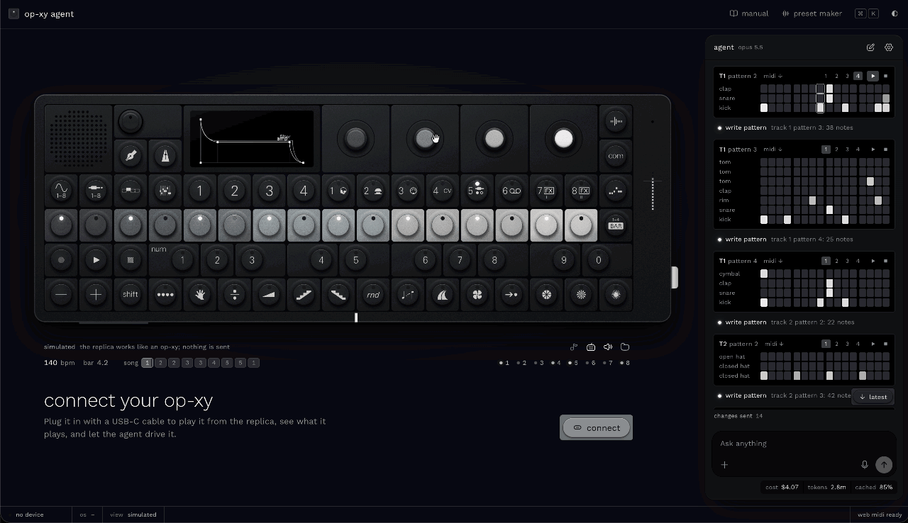

# OP-XY Agent

A browser app for learning, playing and programming the Teenage Engineering **OP-XY**. It pairs a
replica of the instrument that you can play with an AI agent that knows the machine inside out. The
agent teaches it, and it programs it for you. It runs in a desktop browser; a phone gets a preview
and the link to open on a computer.

**[Open the app →](https://neovand.github.io/op-xy-agent/)** ·
[the manual](https://neovand.github.io/op-xy-agent/manual) ·
[the preset maker](https://neovand.github.io/op-xy-agent/presets)

It is pre-production and moving fast. The roadmap is in [`docs/PLAN.md`](docs/PLAN.md) and the
north star in [`docs/VISION.md`](docs/VISION.md).

## What it does

### A replica you can play

- **Drawn from the device.** The panel comes from the drawing in TE's public guide, so every key,
  encoder, LED and legend sits where it does on the OP-XY.
- **Its screen runs our own simulator** of the OP-XY's interface, drawn at the display's 480 × 222
  pixels in the device's screen font. It covers:
  - the modes, M1–M4 and their shift layers;
  - the engines, envelopes, filters and LFOs;
  - the players and the auxiliary tracks;
  - the mixer, arrange and song mode, tempo, project and COM.

  Pages the guide never drew were rebuilt from camera captures of a real unit.

- **It sounds.**
  - The eight synth engines are fitted to recordings of a real OP-XY.
  - The samplers and drum kits play too.
  - The sequencer runs with its step components, parameter locks and players.
  - The punch-in effects work.
- **Play it with the mouse or your computer keyboard.** Your work stays across reloads, and a song
  exports as WAV or MIDI.

### An agent that teaches and does

- **It answers from our own manual**, reworded from TE's material, and says which section it used.
  The manual has 166 units, and every fact cites its source.
- **"How do I…?" gets the exact keys and encoder turns from where you are.** They are tried on a
  copy of the replica first. The agent can play them on the replica, or light them one at a time and
  wait for you to press each.
- **It turns ideas into music and sound:**
  - patterns written note by note, chords by name, drum grids;
  - scenes and a song;
  - sounds from a description: a plucky bass, a pad that swells, a bass that pumps with the kick.
- **It reads back what it wrote as a musician would:** the chords, the key, notes that clash, how a
  bass meets the kick. It can also listen to the result, on the replica or on your OP-XY over USB
  audio.
- **It is careful.** Bigger jobs are rehearsed on copies of the replica before they land. Every
  change can be undone, and anything that touches your device asks first.
- **It takes attachments:** sheet music (photos or PDFs), MIDI files or text (ABC, lyrics, notes).
  It reads them and plays them. With an OpenAI key you can also talk to it.

### Your OP-XY over USB (Chrome, Edge)

- **Over Web MIDI the replica mirrors what the device plays:** notes in any octave, pitch bend,
  transport, and a clock-driven playhead.
- **The app drives the device:** notes, play and stop, track select, tempo, mutes, and a track's
  sound. Sounds go over the MIDI controls verified on OS 1.1.33.
- **Projects move over USB in the device's MTP mode** (`com → M4`). Load the project that is open on
  the OP-XY into the replica, or save the replica's project to the device as a new one.

### Your own presets

The [preset maker](https://neovand.github.io/op-xy-agent/presets) turns your samples (WAV, AIFF, …)
into a drum kit, a sliced loop, a multisample or a synth sampler preset:

- drum hits land where TE's factory kits keep them;
- a loop is cut at its hits;
- notes are found from the file, or by ear;
- sustained samples get loop points.

No samples? Generate a kit in one of five styles, or ask the agent for one. Download the `.preset`
folder, or install it on your OP-XY over USB after you confirm what it adds. The installer has not
been tried on a unit yet. Everything runs in your browser.

### Bring your own key

API keys are kept in your browser and sent only to their provider: Anthropic for the agent, and
OpenAI for voice. There is no server; the app is static files.

## How close is it to the real thing?

The replica is checked against a real OP-XY running OS 1.1.33, not only against TE's guide. The
evidence comes from:

- camera captures of the screens it draws;
- USB audio measurements of the engines, filters, envelopes, LFOs and effects;
- logs of what the device sends and answers over MIDI and USB.

When the device and the guide disagree, the device wins, and our manual says so.

It is not finished. The [coverage map](docs/research/66-replica-coverage.md) lists 271
capabilities. About 100 of them rest on measurements of the unit so far; the rest follow TE's guide,
its changelog or our own reading. TE's factory samples live in the firmware and can't be shipped,
so the replica plays stand-ins for them. Loading your own samples from the device is built but not
yet tried on a unit.

The [verification plan](docs/research/67-verification-plan.md) works through the rest session by
session. A capability counts as verified once it has device evidence and a test that pins it.

## Safety with your device

- Every byte the app sends to the device goes through one choke point with a deny-list.
- Firmware-update messages are blocked outright.
- Files are written to the device only after you confirm, and never over existing ones.
- Anything that changes the device's state is announced first.

The log of everything our own tests have sent to a real OP-XY is in
[`docs/research/90-device-probe.md`](docs/research/90-device-probe.md).

## Develop

You need Node 24 and pnpm.

```bash
pnpm install
```

```bash
pnpm dev
```

```bash
pnpm check && pnpm lint && pnpm test:unit --run
```

Some research inputs are downloaded rather than committed: TE's public guide pages and pictures, and
community repositories read for reference. The app builds without them. The knowledge scripts and
the dev comparison bench on `/replica` need them:

```bash
scripts/fetch-research.sh
```

Start with [`AGENTS.md`](AGENTS.md), which covers the rules for humans and coding agents alike, and
[`docs/ARCHITECTURE.md`](docs/ARCHITECTURE.md), which covers the layers, the safety choke point and
the conventions.

| Path               | What                                                                                            |
| ------------------ | ----------------------------------------------------------------------------------------------- |
| `src/lib/core/`    | pure TypeScript: MIDI, TE SysEx, the `.xy` project format, MTP, the OP-XY as data, theory       |
| `src/lib/device/`  | Web MIDI and WebUSB, the send choke point and its policy, session, mirror, scheduler            |
| `src/lib/sim/`     | the simulator: state, pages, areas, sequencer, the screen renderer, the key navigator           |
| `src/lib/sound/`   | the replica's sound: engines, samplers, effects, the scheduler, laws fitted to the device       |
| `src/lib/replica/` | the SVG replica and its screen canvas                                                           |
| `src/lib/app/`     | the app around them: the virtual OP-XY the agent drives, project transfer, export, storage      |
| `src/lib/agent/`   | the agent: conductor, tools, skills, the lab, approvals, attachments                            |
| `src/lib/voice/`   | the voice front end (OpenAI realtime), which hands every request to the agent                   |
| `src/lib/manual/`  | our manual: loader and search                                                                   |
| `knowledge/`       | data the app ships: controls, CC map, device map, screen font and icons, skills, our manual     |
| `evals/`           | agent evals, and the probe that talks to the real agent on the built site                       |
| `research/device/` | the scripts used on a real unit: camera, USB audio, MIDI capture, MTP reads                     |
| `docs/`            | vision, plan, decisions, architecture, and the research notes ([index](docs/research/INDEX.md)) |

## Credits and licence

MIT, see [`LICENSE`](LICENSE). Adapted code and artwork sources are listed in [`NOTICE.md`](NOTICE.md).
The preset maker's SoundFont import ports the zone mapping of Charles Vestal's
[sf2-to-opxy](https://github.com/charlesvestal/sf2-to-opxy) (MIT).

OP-XY Agent is an independent project, not affiliated with or endorsed by Teenage Engineering.
"OP-XY" and "teenage engineering" are their owner's trademarks, used here only to describe
compatibility. The manual the app ships is our own wording; TE's guide text is never committed.
